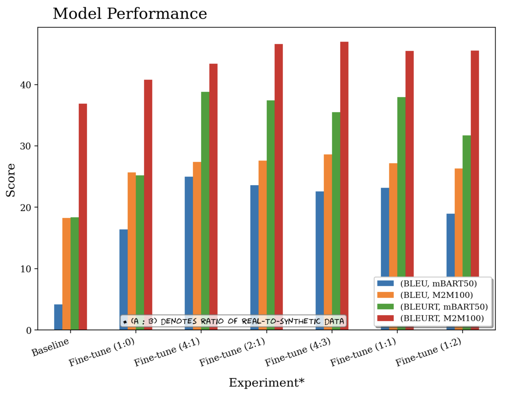
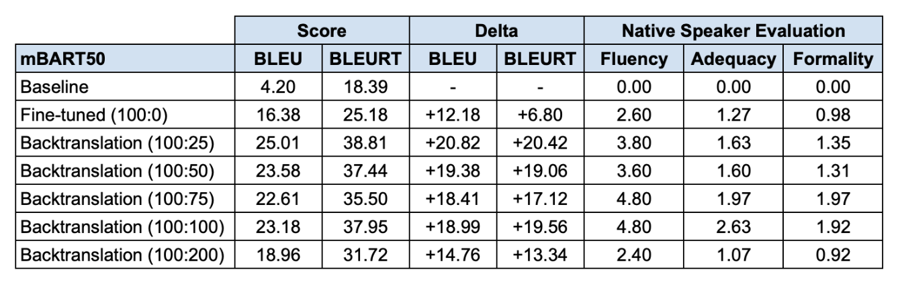
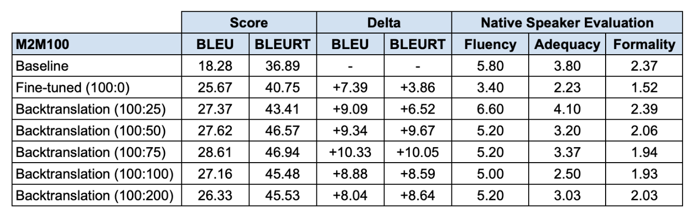

# DATASCI 266: NLP Final Project

## Proposal

With OpenAI CEO Sam Altman's recent call for regulation and democratic processes for generative AI systems before the U.S. Senate, there remains the question of how generative AI tools can be developed to support low-resource language speakers in non-Western cultural contexts. One of the key challenges is addressing the LLM performance gap between high and low-resource languages, due largely to the asymmetric availability of digitized corpora. The low-resource language for this research will be Tagalog, the primary language spoken by the Overseas Filipino Worker (OFW) migrant population, who have had a longstanding history of maltreatment cases in the Middle East and East Asia since the 1970s. Through this project, researchers hope to discover if augmentation techniques can be used to improve machine translation performance, and with this information, outline the steps necessary to address the performance gap between Tagalog and other standard high-resource languages. 

## Abstract

In natural language processing (NLP) research, high-resource languages benefit from extensive digitized data, enabling more advanced and accurate computational models. Conversely, low-resource languages suffer from a scarcity of digitized material, posing significant challenges in developing robust NLP systems. In this study, three state-of-the-art pre-trained LLM models were investigated in combination with several augmentation techniques to assess model translation performance for Tagalog, a low resource language among over 150 dialects spoken in the Philippines. With an iterative approach, BLEU, BLEURT, and native speaker evaluation scores were used to measure model performance of GPT-3.5 turbo, mBART50 and M2M100, with follow up fine-tuning, hyperparameter tuning, and back translation experiments. For GPT-3.5 turbo, prompt engineering with baseline performed the best with a BLEU score of 21.84 and and BLEURT score of 54.81. In the mBART50 model, the 100 real to 25 synthetic performed most optimally with a BLEU score of 25.01 and BLEURT of 38.81. For M2M100, the back-translation setup of 100 real to 75 synthetic was identified as the optimal model exhibiting a BLEU score of 28.61 and a BLEURT score of 46.94.

## Data Sources

- [Flores200](https://www.openai.com](https://github.com/facebookresearch/flores/blob/main/flores200/README.md)https://github.com/facebookresearch/flores/blob/main/flores200/README.md)
- [CulturaX](https://www.openai.com](https://huggingface.co/datasets/uonlp/CulturaX)https://huggingface.co/datasets/uonlp/CulturaX)

## Results





## Repo Structure

```
.
├── Augmented Datasets
│   ├── M2M100
│   │   └── Synthetic_splits.json
│   └── mBART50
│       └── Culturax_splits_2.json
├── CulturaX
│   │   ├── Culturax_splits_1.json
│   │   └── Culturax_splits_2.json
│   └── mBART50
│       ├── Culturax_splits_1.json
│       └── Culturax_splits_2.json
├── Figures
│   ├── m2m100_results.png
│   ├── mbart50-m2m100_bar_plot.png
│   └── mbart50_results.png
├── FloRes200
│   ├── test_eng_inputs.txt
│   ├── test_tgl_labels.txt
│   ├── train_eng_inputs.txt
│   ├── train_tgl_labels.txt
│   ├── val_eng_inputs.txt
│   └── val_tgl_labels.txt
├── M2M100 Results
│   ├── Baseline
│   │   └── pred_test_tgl_labels.txt
│   ├── Finetune-100-to-0
│   │   └── pred_test_tgl_labels.txt
│   ├── Finetune-100-to-25
│   │   └── pred_test_tgl_labels.txt
│   ├── Finetune-100-to-50
│   │   └── pred_test_tgl_labels.txt
│   ├── Finetune-100-to-75
│   │   └── pred_test_tgl_labels.txt
│   ├── Finetune-100-to-100
│   │   └── pred_test_tgl_labels.txt
│   └── Finetune-100-to-200
│       └── pred_test_tgl_labels.txt
├── gpt-3.5_json_prompts
│   ├── flores_eng_tgl_base_train.jsonl
│   └── flores_eng_tgl_base_val.jsonl
├── gpt_results 2
│   ├── BASELINE_FINETUNE_predicted_engtgl_1.txt
│   ├── BASELINE_predicted_engtgl.txt
│   ├── BASELINE_predicted_engtgl_1.txt
│   ├── BASELINE_predicted_engtgl_1000.txt
│   ├── BASELINE_predicted_engtgl_ns.txt
│   ├── FINETUNE_predicted_engtgl_ns.txt
│   ├── HP_FINETUNE_predicted_engtgl_1.txt
│   ├── HP_FINETUNE_predicted_engtgl_ns.txt
│   ├── Prompt1_BASELINE_predicted_engtgl.txt
│   ├── Prompt1_BASELINE_predicted_engtgl_ns.txt
│   ├── Prompt1_FINETUNE_predicted_engtgl.txt
│   ├── Prompt2_BASELINE_predicted_engtgl.txt
│   ├── Prompt2_BASELINE_predicted_engtgl_ns.txt
│   ├── Prompt2_FINETUNE_predicted_engtgl.txt
│   ├── Prompt3_BASELINE_predicted_engtgl.txt
│   ├── Prompt3_BASELINE_predicted_engtgl_ns.txt
│   └── Prompt3_FINETUNE_predicted_engtgl.txt
├── mBART50 Results
│   ├── Baseline
│   │   └── pred_test_tgl_labels.txt
│   ├── Finetune-100-to-0
│   │   └── pred_test_tgl_labels.txt
│   ├── Finetune-100-to-25
│   │   └── pred_test_tgl_labels.txt
│   ├── Finetune-100-to-50
│   │   └── pred_test_tgl_labels.txt
│   ├── Finetune-100-to-75
│   │   └── pred_test_tgl_labels.txt
│   ├── Finetune-100-to-100
│   │   └── pred_test_tgl_labels.txt
│   └── Finetune-100-to-200
│       └── pred_test_tgl_labels.txt
├── Final_Project_266.pdf
├── README.md
├── gpt3_5_turbo_baseline,_prompt_eng,_finetuning.ipynb
├── henry_mBART50.ipynb
└── m2m100.ipynb
```

## Acknowledgements

We want to thank Mark and Jennifer for their guidance and advice on our experimental approaches. 
